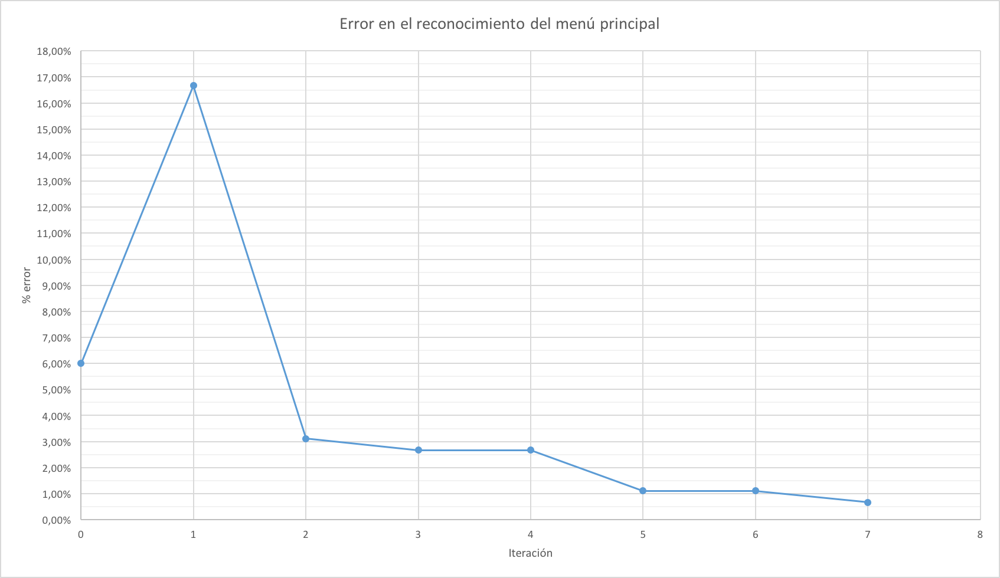

# Práctica 3

Se pide implementar una aplicación web que permita encapsular el acceso a una aplicación legada MS-DOS/BASIC. La aplicación legada se ejecutará sobre el emulador DOSBox, y la aplicación web deberá interactuar con el emulador y usar tecnología de reconocimiento de caracteres (OCR) para leer resultados del emulador.

La aplicación legada consiste en un programa para gestionar una base de datos de programas, de los que se guardan el nombre, tipo, cinta y registro. La nueva aplicación deberá proporcionar las siguientes funcionalidades:

* Visualización del número de registros del sistema legado

* Listado de los datos de un programa a partir de su nombre

* Listado de los programas que contiene una cinta concreta, en el orden en que se encuentran grabados.

La aplicación web se ha implementado con Spring Boot en la parte del servidor y AngularJS en la parte del cliente (navegador). Para el reconocimiento de caracteres se ha utilizado el motor [Tesseract](https://github.com/tesseract-ocr/tesseract), a través de la librería Java [Tess4J](http://tess4j.sourceforge.net/).

Se ha estructurado la aplicación siguiendo el modelo vista-controlador-servicio (MVC) para separar la interfaz de la lógica que interactúa con el emulador.

## Acceso a la aplicación legada mediante un *wrapper*

Para encapsular el acceso a la aplicación legada se ha creado el servicio `ProgramManager`. La implementación de este servicio accede al programa de la siguiente forma:

1. Cuando se instancia el servicio, se inicia el emulador con la aplicación legada: `dosbox msdos-database/gwbasic.bat -noconsole`.

2. Una vez que el emulador está corriendo, el *wrapper* simula pulsaciones de teclado mediante la librería `java.awt.Robot`. Para ello, se debe llamar a las funciones de pulsación (`keyPress`) y liberación (`keyRelease`) para cada tecla que se quiere enviar al emulador. También hay que destacar que la ventana del emulador debe tener el foco cuando se está ejecutando el *wrapper*, o las pulsaciones irán a otra ventana. Por esta razón se ha incluído una espera de 2 segundos en el controlador `ProgramController` para poder cambiar el foco del navegador a la ventana del emulador cuando se ejecutan en la misma máquina.

3. Para la lectura de resultados del emulador se deben realizar dos acciones:

  1. Primero se toma una captura de la pantalla enviando a DOSBox la combinación <kbd>CTRL</kbd>+<kbd>F5</kbd>. Esta combinación de teclas genera una captura de la pantalla del emulador (independientemente de la posición de la ventana) y la guarda en el directorio `./capture/` (debe estar creado previamente). Este método es más preciso que calcular el tamaño y la posición de la ventana y después realizar una captura de pantalla con el método `createScreenCapture` de la clase `Robot`, como se propone en el guión de la práctica:

    ```java
    private File captureScreen() throws InterruptedException {
      logger.fine("Capturing screen...");
      robot.keyPress(KeyEvent.VK_CONTROL); robot.keyPress(KeyEvent.VK_F5);
      Thread.sleep(DELAY_KEYPRESS);
      robot.keyRelease(KeyEvent.VK_CONTROL); robot.keyRelease(KeyEvent.VK_F5);
      File capturesDir = new File(CAPTURES_DIR);
      // Give dosbox enough time to process the screenshot and write it to the filesystem
      Thread.sleep(DELAY_SCREENSHOT);
      File[] captures = capturesDir.listFiles();
      if (captures != null) {
        File capture = captures[captures.length - 1];
        logger.info("Generated screen capture in file " + capture.getName());
        return capture;
      } else {
        logger.warning("No capture file generated");
        return null;
      }
    }
    ```

  2. Una vez que se ha realizado una captura de la pantalla del emulador, es necesario realizar el reconocimiento de caracteres con Tesseract:

    ```java
    String readScreen() throws InterruptedException, IOException {
      File capture = captureScreen();
      if (capture != null) {
        try {
          String ocrResult = ocr.doOCR(capture);
          logger.finest("Text recognized with Tesseract: \n" + ocrResult);
          return ocrResult;
        } catch (TesseractException e) {
          logger.log(Level.SEVERE, e.getMessage(), e);
        }
      }
      return null;
    }
    ```

4. Después de obtener un `String` con el resultado de Tesseract, se hace uso de expresiones regulares para confirmar que el emulador se encuentra en una pantalla determinada o interpretar los datos mostrados (listado de programas, etc.).

Se han tenido en cuenta los siguientes aspectos temporales de retrasos a la hora interactuar con el emulador:

* Tiempo que el emulador necesita para detectar una pulsación de teclado (tiempo que la tecla necesita estar pulsado antes de liberarse, tiempo entre pulsaciones)

* Tiempo que la aplicación necesita para procesar una pulsación

* Tiempo que DOSBox necesita para generar una captura de pantalla y escribirla en el disco

Ajustando estos tiempos (constantes `DELAY_KEYPRESS`, `DELAY_BETWEEN_KEYS` y `DELAY_SCREENSHOT` en la clase `ProgramManagerImpl`) se puede acelerar la interacción con el emulador y hacer funcionar la aplicación rápido.

Otra mejora posible para acelerar la aplicación es configurar la CPU el emulador para que ejecute la aplicación legada a una velocidad superior (siempre que la máquina en la que se ejecute el emulador sea lo suficientemente rápida). Esto se puede conseguir modificando el fichero `dosbox.conf`:

```
[cpu]
cycles = max
```

## Entrenamiento de Tesseract

Tras programar el comportamiento descrito anteriormente, se comprobó que con los datos de entrenamiento iniciales (incluídos con el guión de la práctica) no se reconocían correctamente muchos de los caracteres, haciendo imposible el *parseado* de las capturas de pantalla para crear objetos Java (la tasa de error en algunos de los menús era mayor del 10%).

Para mejorar los datos de entrenamiento se usó el programa [MzTesseract](https://github.com/mazluta/MzTesseract/wiki) sobre Windows para corregir los ficheros .box generados (existen [otras aplicaciones](https://github.com/tesseract-ocr/tesseract/wiki/AddOns) para este propósito, pero MzTesseract era la que mejor funcionaba) y un [script](training/train.sh) sobre Linux para generar los datos de entrenamiento (fichero .traineddata).

Tras 7 iteraciones del proceso de entrenamiento con capturas de pantallas diferentes, se consiguió mejorar la tasa de fallo en el reconocimiento del menú principal del 6.0% (con los datos de entrenamientos iniciales) a menos del 0.70%:



Aún así, algunos caracteres se confunden a aplicar el reconocimiento de caracteres (por ejemplo, el número `7` en algunos menús se confunde siempre con el caracter `?`). Este comportamiento no se ha podido corregir, pero ocurre solamente con unos pocos caracteres, por lo que se puede programar para realizar la sustitución cuando haya duda en algún caracter problemático.
