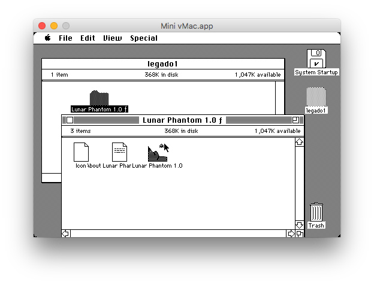
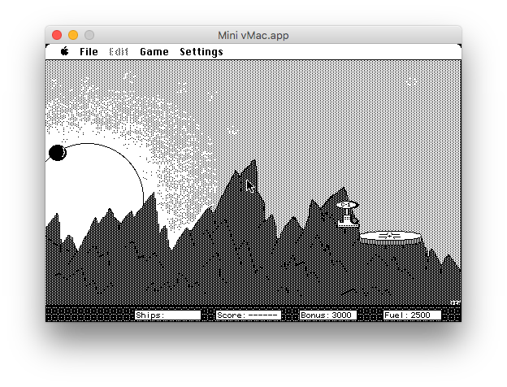
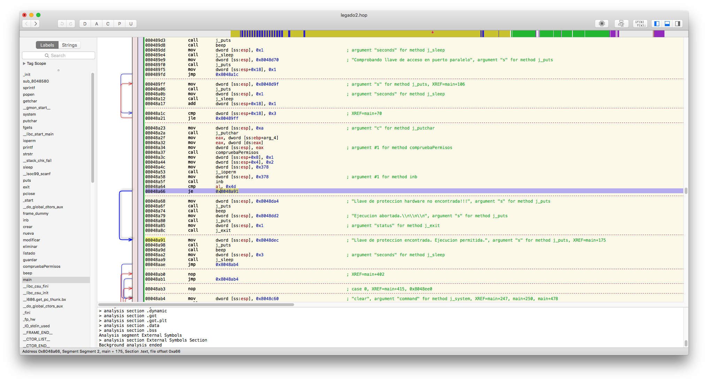
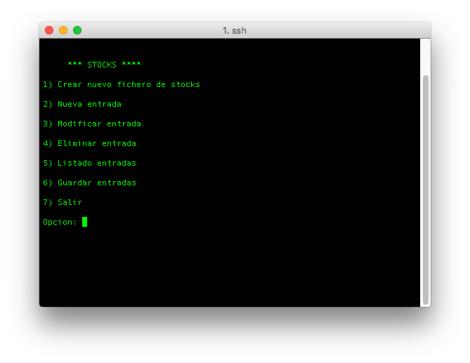

# Práctica 5

Esta práctica proporciona dos ficheros binarios, `legado1.bin` y `legado2.bin`, que se han recuperado de un backup antiguo. No se dispone de documentación ni código fuente, solamente se sabe que `legado1.bin` corresponde a un simulador de vehículo gravitacional y `legado2.bin` es un gestor de stocks. El objetivo es ejecutar las aplicaciones correctamente y que muestren las pantallas que se proporcionan en el guión de la práctica.

La parte optativa de la práctica consiste en conseguir reproducir un fichero de texto diseñado para la aplicación *Text Assist*, incluida en el software distribuido con las tarjetas Creative Soundblaster 16.

## `legado1.bin`

Si se ejecuta la utilidad `file` incluida en el paquete [`coreutils`](https://www.gnu.org/ software/coreutils/coreutils.html) de GNU, se obtiene el siguiente resultado:

<pre>
<b>$</b> file legado1.bin
legado1.bin: Macintosh HFS data block size: 512, number of blocks: 2874, volume name: legado1
</pre>

Por lo tanto, el fichero corresponde a un volumen HFS de un sistema Macintosh. Con un emulador de Macintosh como [Mini vMac](http://www.gryphel.com/c/minivmac/) es posible montar el volumen desde el fichero y ejecutar la aplicación.

Para ejecutar el emulador es necesario conseguir primero la ROM de un Macintosh Plus (hardware emulado por las variaciones estándar del emulador).

También es necesario contar con una imagen del sistema operativo. *System 6.0.8* está disponible de manera gratuita en la página web de Apple: [disco 1](http://download.info.apple.com/Apple_Support_Area/Apple_Software_Updates/English-North_American/Macintosh/System/Older_System/System_6.0.x/SSW_6.0.8-1.4MB_Disk1of2.sea.bin), [disco 2](http://download.info.apple.com/Apple_Support_Area/Apple_Software_Updates/English-North_American/Macintosh/System/Older_System/System_6.0.x/SSW_6.0.8-1.4MB_Disk2of2.sea.bin). Estos ficheros están comprimidos con el software *[Stuffit](https://en.wikipedia.org/wiki/StuffIt)*. Una vez descomprimidos, el fichero resultante *System Startup* contiene el sistema operativo.

Después de iniciar el emulador con la ROM y System 6.0.8 se puede abrir la imagen de disco `legado1.bin`:



Esta contiene la aplicación *Lunar Phantom 1.0 ƒ*, la cual se puede ejecutar directamente:



## `legado2.bin`

Para identificar el tipo de fichero se puede usar la misma utilidad que para el primero:

<pre>
<b>$</b> file legado2.bin
legado2.bin: ELF 32-bit LSB executable, Intel 80386, version 1 (SYSV), dynamically linked, interpreter /lib/ld-linux.so.2, for GNU/Linux 2.6.15, BuildID[sha1]=0d11cdb7be3800c844625e32520df530e7a5ee6d, not stripped
</pre>

El binario contiene una aplicación compilada para GNU/Linux de 32 bits. Si se ejecuta en una máquina Linux genera la siguiente salida (se debe ejecutar con suficientes permisos para acceder al puerto I/O (`CAP_SYS_RAWIO`) o generará un fallo de segmentación):

<pre>
Bienvenido a Stocks v 2.35

Comprobando llave de acceso en puerto paralelo
.
.
.

Llave de proteccion hardware no encontrada!!!
Ejecucion abortada.


</pre>


Por la salida que genera parece que intenta acceder a un dispositivo en el puerto paralelo para buscar una llave de protección hardware. Se ejecuta el programa com [`strace`](http://man7.org/linux/man-pages/man1/strace.1.html), una utilidad que muestra las llamadas al sistema que realiza el ejecutable, así como el resultado que devuelve el sistema operativo:

```c
$ strace -y ./legado2.bin > /dev/null
[...]
write(1</dev/pts/0>, "\7Comprobando llave de acceso en "..., 48) = 48
write(1</dev/pts/0>, ".\n", 2)          = 2
nanosleep({tv_sec=1, tv_nsec=0}, 0xbfdd1d38) = 0
write(1</dev/pts/0>, ".\n", 2)          = 2
nanosleep({tv_sec=1, tv_nsec=0}, 0xbfdd1d38) = 0
write(1</dev/pts/0>, ".\n", 2)          = 2
nanosleep({tv_sec=1, tv_nsec=0}, 0xbfdd1d38) = 0
write(1</dev/pts/0>, "\n", 1)           = 1
pipe2([3<pipe:[2972168]>, 4<pipe:[2972168]>], O_CLOEXEC) = 0
clone(child_stack=NULL, flags=CLONE_CHILD_CLEARTID|CLONE_CHILD_SETTID|SIGCHLD, child_tidptr=0xb75e9768) = 3810
close(4<pipe:[2972168]>)                = 0
fcntl64(3<pipe:[2972168]>, F_SETFD, 0)  = 0
fstat64(3<pipe:[2972168]>, {st_mode=S_IFIFO|0600, st_size=0, ...}) = 0
read(3<pipe:[2972168]>, "-rwxr--r-- 1 dbarelop dbarelop 7"..., 4096) = 63
close(3<pipe:[2972168]>)                = 0
wait4(3810, [{WIFEXITED(s) && WEXITSTATUS(s) == 0}], 0, NULL) = 3810
--- SIGCHLD {si_signo=SIGCHLD, si_code=CLD_EXITED, si_pid=3810, si_uid=0, si_status=0, si_utime=0, si_stime=0} ---
ioperm(0x378, 0x2, 1)                   = 0
write(1</dev/pts/0>, "Llave de proteccion hardware no "..., 46) = 46
write(1</dev/pts/0>, "\7Ejecucion abortada.\n\n\n", 23) = 23
[...]
```

Como se aprecia en la salida de `strace`, el programa realiza una ejecuta la llamada al sistema `ioperm` para activar los bits de permiso de acceso al dispositivo en el puerto de entrada/salida `0x378` (correspondiente al puerto paralelo `LPT1`), y no realiza ninguna llamada al sistema más antes de mostrar el mensaje "Llave de protección hardware no encontrada!!!". Esto significa que se accede a un dispositivo en el puerto paralelo `LPT1` para determinar si se tiene acceso o no al programa.

Para determinar qué test realiza el programa para saber si se tiene acceso o no se ha utilizado el descompilador [Hopper Disassembler](https://www.hopperapp.com/) (disponible solamente para macOS, también se podrían usar utilidades genéricas como `objdump` para fines similares):



El pseudocódigo generado por Hopper concuerda con los resultados de `strace`:

```c
int main(int arg0, int arg1) {
    esp = (esp & 0xfffffff0) - 0x20;
    system("clear");
    puts("Bienvenido a Stocks v 2.35\n");
    beep();
    sleep(0x1);
    puts("Comprobando llave de acceso en puerto paralelo");
    while (*(esp + 0x18) <= 0x3) {
            puts(0x8048d9f);
            sleep(0x1);
    }
    putchar(0xa);
    eax = *arg1;
    compruebaPermisos(eax);
    ioperm(0x378, 0x2, 0x1);
    if (inb(0x378) == 0x4d) goto loc_8048a91;

loc_8048a68:
    puts("Llave de proteccion hardware no encontrada!!!");
    beep();
    puts("Ejecucion abortada.\n\n\n");
    eax = exit(0x1);
    return eax;

loc_8048a91:
    puts("Llave de proteccion encontrada. Ejecucion permitida.");
    beep();
    sleep(0x3);
    goto loc_8048ab4;

    // [...]
}

// [...]

int inb(int arg0) {
    asm{ in         al, dx };
    eax = arg0 & 0xffff & 0xff;
    return eax;
}
```

Después de la llamada al sistema `ioperm`, el programa ejecuta la función `inb`. Esta función ejecuta la instrucción x86 `IN` para leer del puerto paralelo y devuelve el byte leído. Después se comprueba que el valor devuelto por `inb` sea igual a `0x4d`. Si esta comprobación tiene éxito, el programa asume que la llave de protección está presente. De lo contrario, aborta la ejecución.

Para hacer creer al programa que la llave de protección está conectada y conseguir que funcione hay dos opciones:

* Crear un dispositivo virtual en el puerto `LP1` que devuelva `0x4d`

* Modificar la condición del programa para que siempre devuelva TRUE

Como el programa no realiza ninguna comprobación del mismo la opción más sencilla es la segunda. Para ello, basta con echar un vistazo al código que realiza la comprobación:

```asm
call       inb
cmp        al, 0x4d
je         0x8048a91
```

Se necesita invertir la condición para que en lugar de realizar el salto si el valor coincide con `0x4d` (instrucción `je`, *jump if equals*):

```asm
call       inb
cmp        al, 0x4d
je         0x8048a91
```

*Hopper* tiene soporte para este tipo de operaciones y permite guardar el fichero modificado. Tras realizar la modificación, el programa se ejecuta correctamente:



La diferencia entre el fichero parcheado y el original (`objdump`):

```diff
2c2
< legado2_patched.bin:     formato del fichero elf32-i386
---
> legado2.bin:     formato del fichero elf32-i386
388,392c388,389
<  8048a21:	e9 6b 00 00 00       	jmp    8048a91 <main+0xda>
<  8048a26:	90                   	nop
<  8048a27:	90                   	nop
<  8048a28:	90                   	nop
<  8048a29:	90                   	nop
---
>  8048a21:	7e dc                	jle    80489ff <main+0x48>
>  8048a23:	c7 04 24 0a 00 00 00 	movl   $0xa,(%esp)
```

[Aquí](legado2_patch.bin) se puede encontrar el parche creado con la utilidad [bsdiff](http://www.daemonology.net/bsdiff/) que se puede aplicar al fichero original.

## Parte optativa

Encontrar el software necesario para leer el fichero `SB.TXT` ha sido complicado; muchas páginas están caídas hoy en día y ni los drivers ni el software TextAssist están disponibles en ninguna página oficial. Para la búsqueda de información y recursos ha sido muy útil la plataforma [Wayback Machine](https://web-beta.archive.org/), que mantiene backups cada cierto tiempo muchas páginas, incluyendo algunas páginas desde antes de 1998.

Por suerte, se ha encontrado la [página oficial de Jake Gross](http://grossgang.com/), en la que hay subidas imágenes de máquinas virtuales VMWare de diferentes versiones de Windows. En concreto, la de Windows 95 ([http://grossgang.com/vmware/Windows%2095.exe](http://grossgang.com/vmware/Windows%2095.exe)) es de especial utilidad porque *tiene preinstalados todos los drivers y el software necesario* para correr TextAssist.

Para ejecutar la máquina virtual es necesario usar [VMWare Workstation Player](http://www.vmware.com/products/player/playerpro-evaluation.html) sobre Windows o Linux (con VMWare Fusion sobre macOS el audio de la máquina virtual no funciona).

Sin embargo, no tiene instalado el idioma español, por lo que no consigue reproducir el fichero.

Se ha encontrado otro software, [FonixTalk Speak](http://www.speechfxinc.com/fonixtalk.html) que tiene instalado el idioma español y consigue reproducir la canción. Ha habido que corregir el fichero `SB.TXT`:

* Eliminar línea de idioma

* Reemplazar ', ' por ','

* Reemplazar 'rx' por 'r'

* Reemplazar 'sx' por 's'

El audio de la canción reproduciéndose se puede descargar en [este enlace](cancion.mp3).
